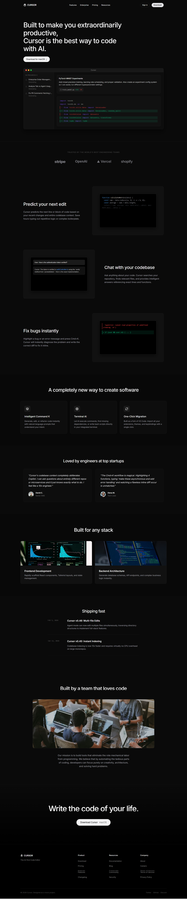

# Cursor AI Editor - Landing Page Clone

> **Web Dev Cohort 2026 - Peer Review Assignment**  
> **Author:** Prashant Saini  
> **Tech Stack:** Pure HTML5 & CSS3 (No Frameworks)

---

## 📌 Project Overview

This project is a high-fidelity, desktop-first, and fully responsive clone of the **Cursor AI Code Editor** landing page. Built entirely from scratch using vanilla HTML and CSS, it demonstrates advanced proficiency in modern web layouts, deep CSS Grid/Flexbox architectures, UI dark-mode transparency handling, and strict adherence to official brand guidelines.

## ⚙️ Technical Specifications

### Design & Layout Architecture
- **Semantic HTML5:** Built using clean, accessible, and semantic landmarks (`<header>`, `<nav>`, `<main>`, `<section>`, `<footer>`).
- **CSS Grid & Flexbox:** Extensively utilized for complex modular component alignments, including the alternating feature blocks and the multi-column footer grids.
- **Translucent Glass-Dark UI:** Instead of relying on static hardcoded blacks, UI cards and editor mockups employ `rgba()` translucency. This advanced technique ensures seamless depth perception and perfect blending over the deep Rangitoto background.
- **Fully Responsive Architecture:** Multi-tier CSS media queries implemented to gracefully adapt layouts across Desktop (`>1024px`), Tablet (`768px - 1024px`), and Mobile (`<480px`) viewports.

### Official Brand Guidelines Implemented
All assets and color systems strictly follow the provided Cursor design system:
- **Primary Accent (International Orange):** `#F54E00` — Used for high-conversion CTAs and interactive highlights.
- **Dark Mode Surface (Rangitoto):** `#26251E` — A premium deep olive-black tint replacing generic web backgrounds.
- **Light UI Typography (Cararra):** `#F7F7F4` — A smooth off-white specifically deployed for premium typography contrast.

## 🏗️ Core Components Developed

The following core landing page modules were successfully built:
1. **Global Navigation:** Sleek top bar featuring official SVG brand assets and CTA buttons.
2. **Hero Header:** High-impact typography with a pure CSS hero layout, avoiding heavy image dependencies.
3. **Editor UI Mockup:** A CSS-simulated overlapping code editor interface (Sidebar, Active Tabs, Mock Code Diff) avoiding standard flat images.
4. **Trusted Partners:** Opacity-controlled logo showcase layout.
5. **Alternating Feature Showcases:** Custom `flex-direction: row-reverse` toggles explaining core AI features.
6. **Bento Box Capabilities Grid:** A modern grid highlighting Terminal AI and One-Click Migration.
7. **Testimonial Social Proof:** Card-based testimonial layout with image avatars.
8. **Multi-Column Footer:** Deep navigational matrix matching the source architecture.

## 🚀 Setup & Execution
1. Clone this repository locally.
2. Open `index.html` in any modern browser (or launch via VS Code Live Server).
3. **Zero Dependencies:** No Tailwind, Node, or NPM installations are required.

## 🌐 Connect with Me

